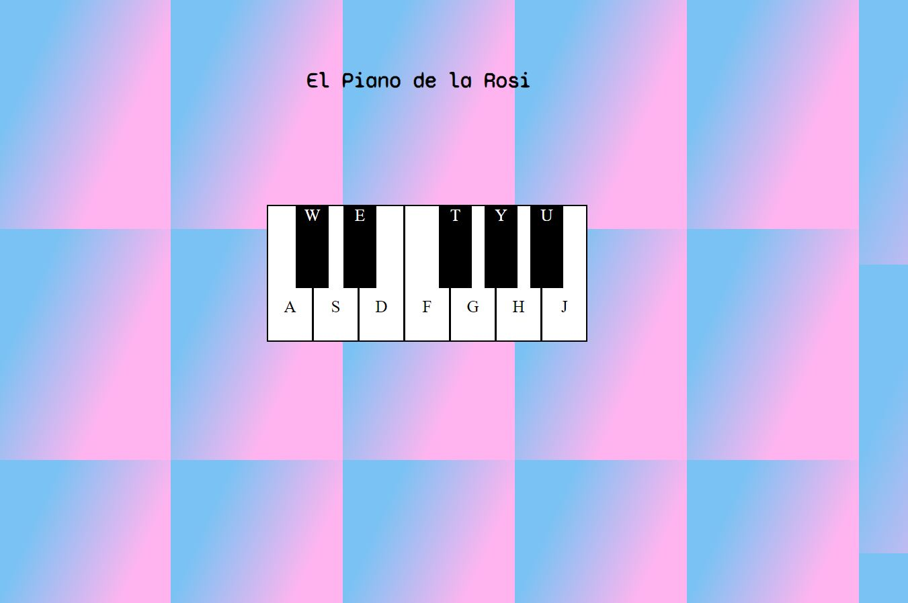

**Virtual Piano**
- A JetBrains Academy Project
- Use HTML, CSS, & JS to play piano sound on key-press.

I've had a lot of fun during this project mixing my passion for music and for tech.

**About**: You will be able to create some rythms based on different vocals and words from the famous singer ROSALIA. Enjoy and have fun!

The completed project allows you to play the piano using `A S F G H J & W E T Y U` and setup the piano without using any images. It taught me positioning and the use of events using Javascript.

**Acknowledgements**
- JetBrains Academy
- W3Schools
- WebDev
- MDN web docs